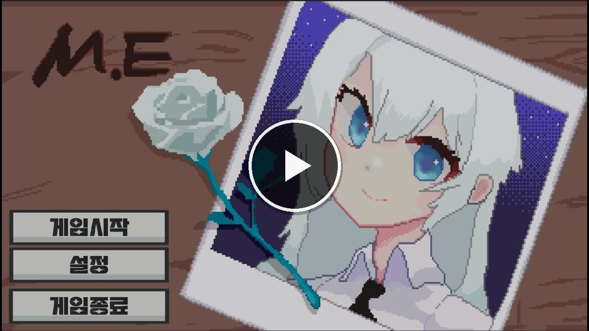

  <a href="README.md">한국어</a> · <b>English</b>

  

  <h1>
    <b>M.E</b>
  </h1>
  (Mountain Everest)
  

    
  

  

    A hardcore platformer where <b>MEL</b>, a wheelchair user, 
    climbs Everest with a pair of grappling hooks
  

  

    
    
    
  

  

    <a href="https://store.onstove.com/ko/games/2303"><b>Play on STOVE</b></a>
    &nbsp;·&nbsp;
    <a href="https://youtu.be/WQsEJXrU3EA"><b>Watch the demo</b></a>
  

## Demo

  

## About

Have you ever played [Getting Over It with Bennett Foddy](https://store.steampowered.com/app/240720/Getting_Over_It_with_Bennett_Foddy/)?

Team **GBSW_Game_Top** took that climb and made it lighter — pixel art, a short run, the same rush.
MEL, who uses a wheelchair, wears a legendary inventor's hooks and climbs a mountain that runs from forest to glacier to outer space.

One more ledge and you're there. One slip and you're back at the bottom.
The summit is still worth throwing the hook again.

## Screenshots

<table>
  <tr>
    <td align="center" width="50%">
      
       <b>Main menu</b>
    </td>
    <td align="center" width="50%">
      
       <b>Settings · Korean / English</b>
    </td>
  </tr>
  <tr>
    <td align="center">
      
       <b>Start at the snow cabin</b>
    </td>
    <td align="center">
      
       <b>Climb the treehouse</b>
    </td>
  </tr>
  <tr>
    <td align="center">
      
       <b>Foggy woods</b>
    </td>
    <td align="center">
      
       <b>Dark caves and traps</b>
    </td>
  </tr>
  <tr>
    <td align="center">
      
       <b>Slippery glacier</b>
    </td>
    <td align="center">
      
       <b>Sunset, with Me written in the clouds</b>
    </td>
  </tr>
  <tr>
    <td align="center">
      
       <b>Low-gravity space</b>
    </td>
    <td align="center">
      
       <b>The last leap to the summit</b>
    </td>
  </tr>
</table>

## Controls

  

<table align="center">
  <tr>
    <th align="center">Action</th>
    <th align="center">Keys</th>
    <th align="center">What it does</th>
  </tr>
  <tr>
    <td align="center">Throw hook</td>
    <td align="center">Left / right click</td>
    <td align="center">Fire a hook toward the cursor. If it sticks, you fly that way</td>
  </tr>
  <tr>
    <td align="center">Recall hook</td>
    <td align="center"><code>Q</code> / <code>E</code></td>
    <td align="center">Pull a stuck hook back so you can throw it again</td>
  </tr>
  <tr>
    <td align="center">Camera</td>
    <td align="center"><code>W</code> / <code>S</code></td>
    <td align="center">Look up or down to scout the next ledge</td>
  </tr>
  <tr>
    <td align="center">Menu</td>
    <td align="center"><code>Esc</code></td>
    <td align="center">Open settings and the how-to screen</td>
  </tr>
</table>

You can throw or recall a hook even while it's in the air.
Snowballs knock you back. Ice makes you slide. Watch your footing.

## Features

- **Dual hooks** — Throw and recall the left and right hooks separately to build a path
- **One long themed climb** — Forest, cave, glacier, sunset, and space in a single run
- **Ice and snowballs** — Slippery tiles and rolling snow keep knocking your rhythm off
- **Low-gravity space** — You get lighter the closer you get to the top
- **Korean / English** — Switch languages in the in-game settings
- **Resolution, volume, story skip** — Options built for a short run
- **Clear timer** — Your climb time shows up on the ending screen

## Team

<table>
  <tr>
    <td align="center" width="25%">
       
      <b>Han Gyeol Kim</b> 
      Developer / Game Design 
      <a href="https://github.com/sleeeppy">@sleeeppy</a>
    </td>
    <td align="center" width="25%">
       
      <b>Sung Hyun Park</b> 
      Developer 
      <a href="https://github.com/ParkSungHyun123">@ParkSungHyun123</a>
    </td>
    <td align="center" width="25%">
       
      <b>Tae Woo Kim</b> 
      Developer 
      <a href="https://github.com/taeng0720">@taeng0720</a>
    </td>
    <td align="center" width="25%">
       
      <b>Asher</b> 
      Design 
      &nbsp;
    </td>
  </tr>
</table>

  Publisher · <b>SavageGames</b> &nbsp;|&nbsp; Released · 2023.09.11 &nbsp;|&nbsp; Genre · Platformer / Adventure

