

  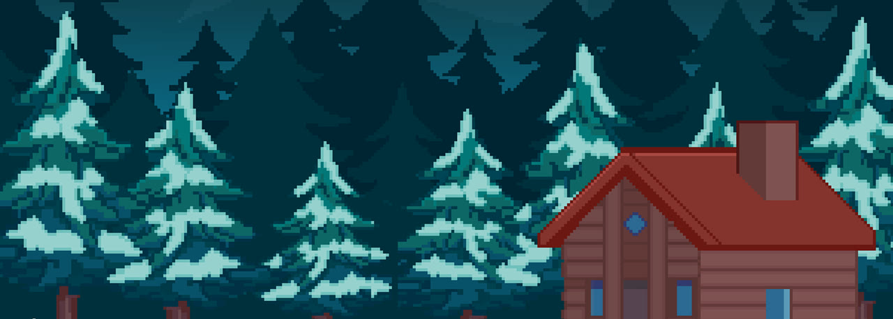

  <h1>M.E</h1>
  <h3>Mountain Everest</h3>

  

    <b>한국어</b> · <a href="README.en.md">English</a>
  

  

    휠체어를 탄 주인공 <b>MEL</b>이 갈고리를 휘둘러 
    에베레스트를 오르는 하드코어 플랫포머
  

  

    
    
    
  

  

    <a href="https://store.onstove.com/ko/games/2303"><b>STOVE에서 플레이</b></a>
    &nbsp;·&nbsp;
    <a href="https://youtu.be/WQsEJXrU3EA"><b>시연 영상 보기</b></a>
  

---

## 시연 영상

  
   
  클릭하면 YouTube에서 시연 영상을 볼 수 있어요 · 5분 16초

---

## 소개

[Getting Over It with Bennett Foddy](https://store.steampowered.com/app/240720/Getting_Over_It_with_Bennett_Foddy/)를 해본 적 있나요?

팀 **GBSW_Game_Top**은 그 짜릿한 등반을 도트 그래픽과 짧은 플레이타임으로 가볍게 바꿔 봤어요.
장애를 가진 MEL은 전설적인 발명가의 갈고리를 착용하고, 숲에서 빙하를 지나 우주까지 이어지는 산을 오릅니다.

한 칸만 더 올라가면 될 것 같은데, 한순간 미끄러지면 다시 밑바닥.  
그래도 정상에 닿는 그 순간이 있어서, 다시 갈고리를 던지게 됩니다.

---

## 스크린샷

<table>
  <tr>
    <td align="center" width="50%">
      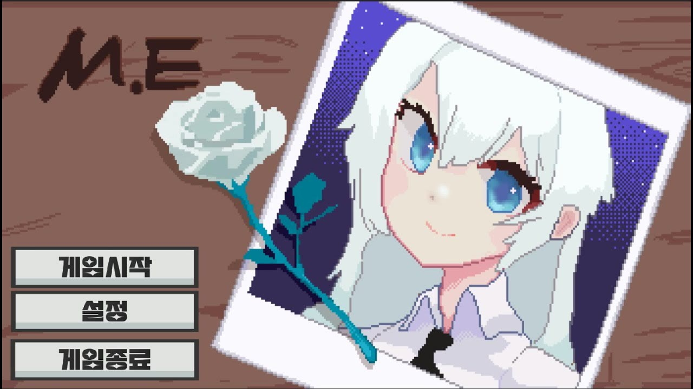
       <b>메인 메뉴</b>
    </td>
    <td align="center" width="50%">
      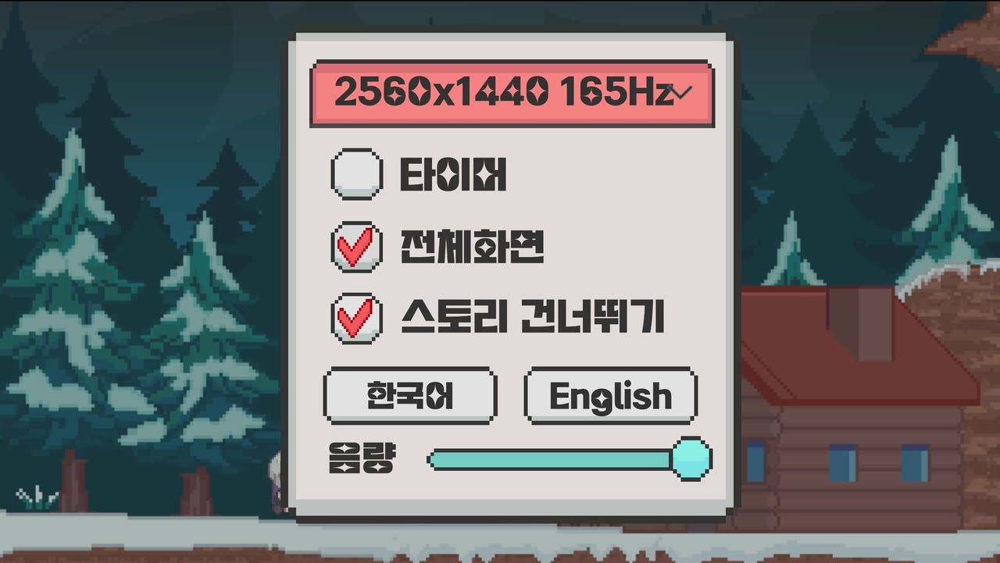
       <b>설정 · 한/영 전환</b>
    </td>
  </tr>
  <tr>
    <td align="center">
      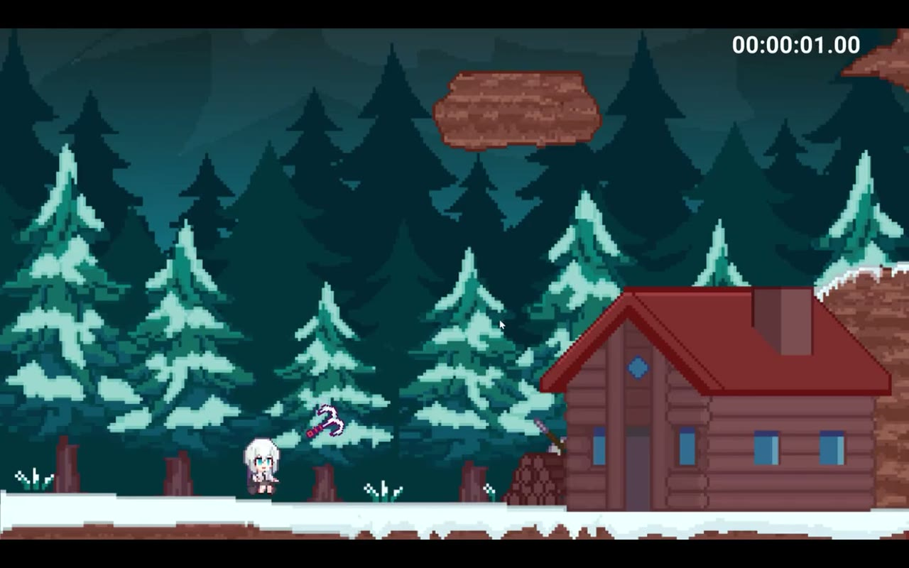
       <b>눈 덮인 오두막에서 출발</b>
    </td>
    <td align="center">
      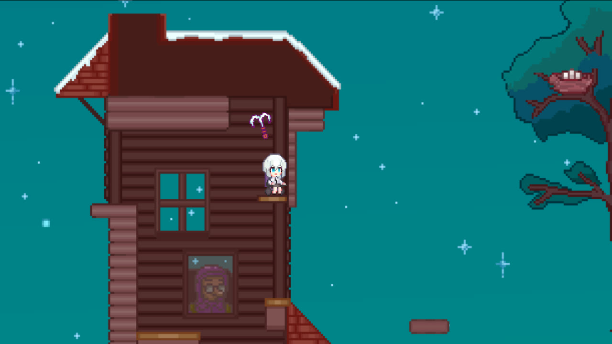
       <b>나무집을 타고 올라가기</b>
    </td>
  </tr>
  <tr>
    <td align="center">
      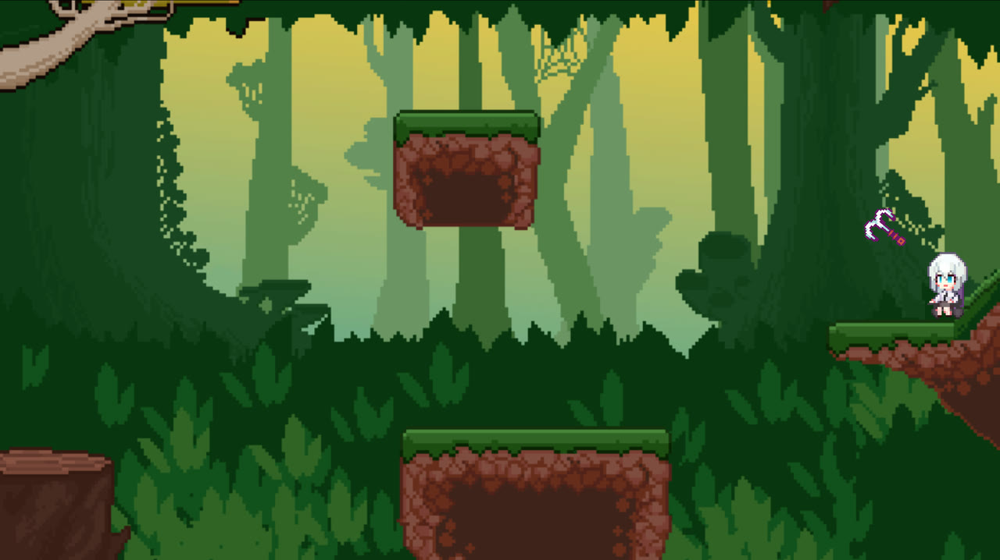
       <b>안개 낀 숲</b>
    </td>
    <td align="center">
      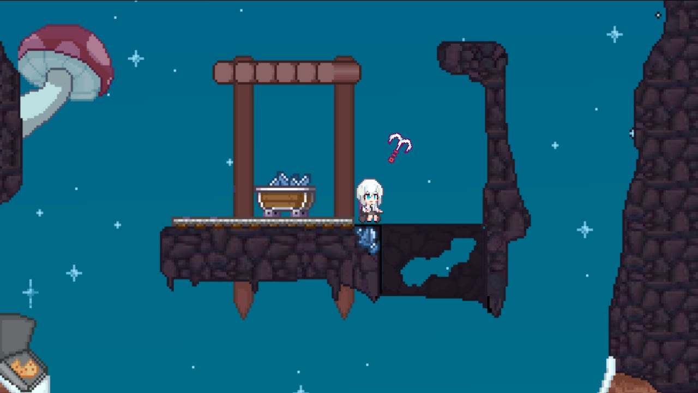
       <b>어두운 동굴과 함정</b>
    </td>
  </tr>
  <tr>
    <td align="center">
      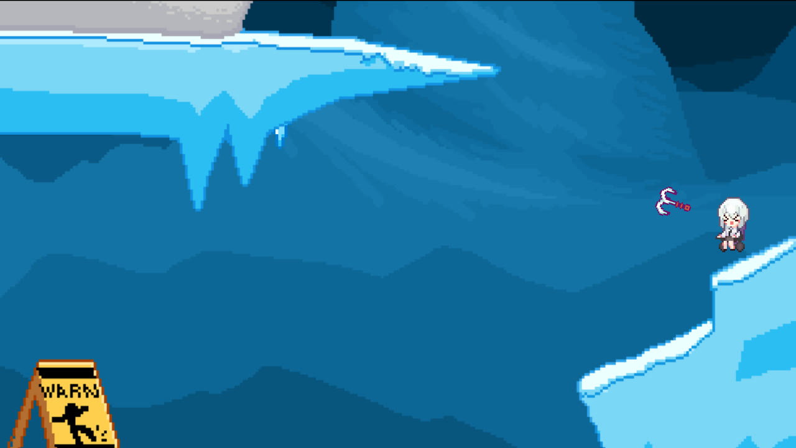
       <b>미끄러운 빙하</b>
    </td>
    <td align="center">
      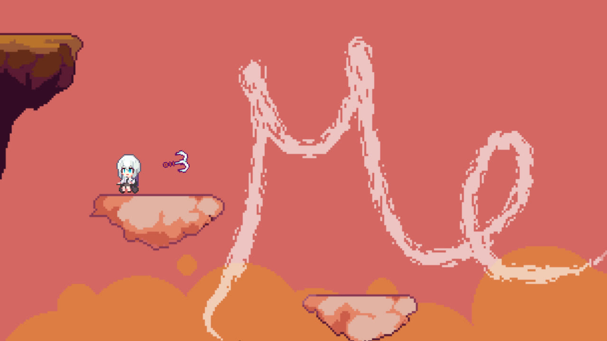
       <b>석양 위, 구름에 새겨진 Me</b>
    </td>
  </tr>
  <tr>
    <td align="center">
      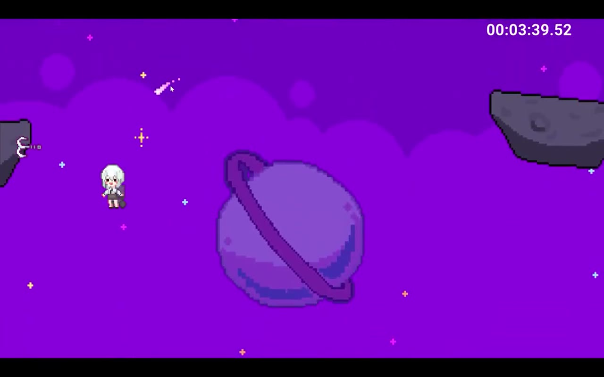
       <b>중력이 약한 우주</b>
    </td>
    <td align="center">
      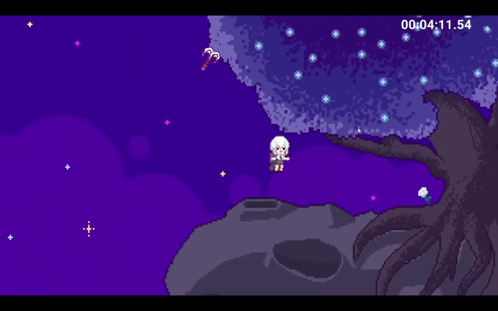
       <b>정상을 향한 마지막 도약</b>
    </td>
  </tr>
</table>

---

## 조작법

  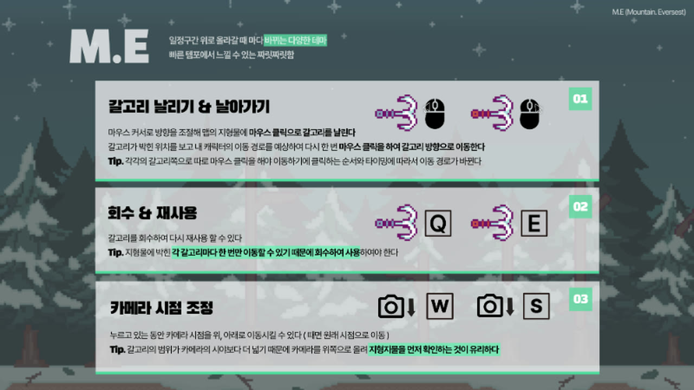

| 조작 | 키 | 설명 |
| :---: | :---: | --- |
| 갈고리 날리기 | 마우스 좌 / 우클릭 | 커서 방향으로 갈고리를 날려 지형에 박으면 그쪽으로 날아갑니다 |
| 갈고리 회수 | `Q` / `E` | 박힌 갈고리를 회수해 다시 던질 수 있습니다 |
| 카메라 | `W` / `S` | 위·아래로 시점을 옮겨 다음 발판을 미리 볼 수 있습니다 |
| 메뉴 | `Esc` | 설정과 설명 화면을 엽니다 |

갈고리는 날아가는 도중에도 던지거나 회수할 수 있어요.  
눈덩이에 맞으면 밀려나고, 얼음 위에서는 미끄러지니 조심하세요.

---

## 여정

산을 오를수록 테마가 바뀌고, 갈고리를 쓰는 감각도 조금씩 달라집니다.

| 구간 | 어떤 곳인가요 |
| --- | --- |
| **오두막 · 설산** | 갈고리의 거리와 각도를 익히는 출발점 |
| **나무집 · 절벽** | 좁은 창틀과 공중 발판을 잇는 정밀한 등반 |
| **숲** | 시야가 가려진 안개 속에서 다음 땅을 찾는 구간 |
| **동굴** | 버섯, 레일, 함정이 숨겨진 어두운 길 |
| **빙하** | 발을 디디면 미끄러지는 얼음. 눈덩이도 굴러옵니다 |
| **석양** | 구름 위에 이름처럼 새겨진 *Me* |
| **우주** | 중력이 약해져 갈고리 한 번의 궤도가 길어집니다 |
| **정상** | 클리어 타임이 기록되는 엔딩 |

---

## 주요 기능

- **듀얼 갈고리** — 왼손·오른손 갈고리를 따로 던지고 회수하며 경로를 만듭니다
- **테마가 바뀌는 한 줄 맵** — 숲, 동굴, 빙하, 석양, 우주까지 한 번의 등반으로 이어집니다
- **얼음과 눈덩이** — 미끄러운 타일과 굴러오는 눈덩이가 페이스를 흔듭니다
- **저중력 우주** — 정상에 가까워질수록 몸이 가벼워집니다
- **한국어 / English** — 인게임 설정에서 바로 바꿀 수 있습니다
- **해상도 · 음량 · 스토리 스킵** — 짧은 런에 맞춰 옵션을 남겨 두었습니다
- **클리어 타이머** — 정상에 도착하면 등반 시간이 엔딩에 표시됩니다

---

## 팀

<table>
  <tr>
    <td align="center">
       
      <b>Han Gyeol Kim</b> 
      Developer / Game Design 
      <a href="https://github.com/sleeeppy">@sleeeppy</a>
    </td>
    <td align="center">
       
      <b>Sung Hyun Park</b> 
      Developer 
      <a href="https://github.com/ParkSungHyun123">@ParkSungHyun123</a>
    </td>
    <td align="center">
       
      <b>Tae Woo Kim</b> 
      Developer 
      <a href="https://github.com/taeng0720">@taeng0720</a>
    </td>
    <td align="center">
      <b>Asher</b> 
      Design
    </td>
  </tr>
</table>

  배급 · <b>SavageGames</b> &nbsp;|&nbsp; 출시 · 2023.09.11 &nbsp;|&nbsp; 장르 · 플랫포머 / 어드벤처

---

## 플레이

- [STOVE 스토어에서 무료로 플레이](https://store.onstove.com/ko/games/2303)
- [시연 영상 · M.E (2024)](https://youtu.be/WQsEJXrU3EA)

인게임 설정에서 한국어와 영어를 바꿀 수 있습니다.
